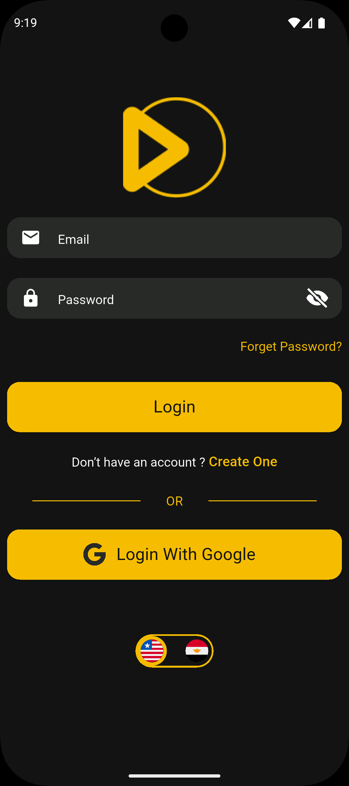
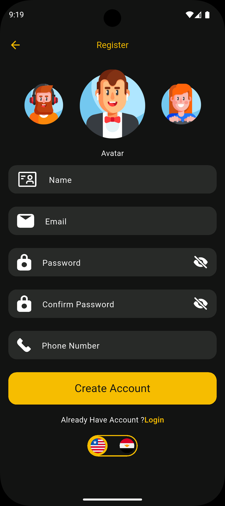
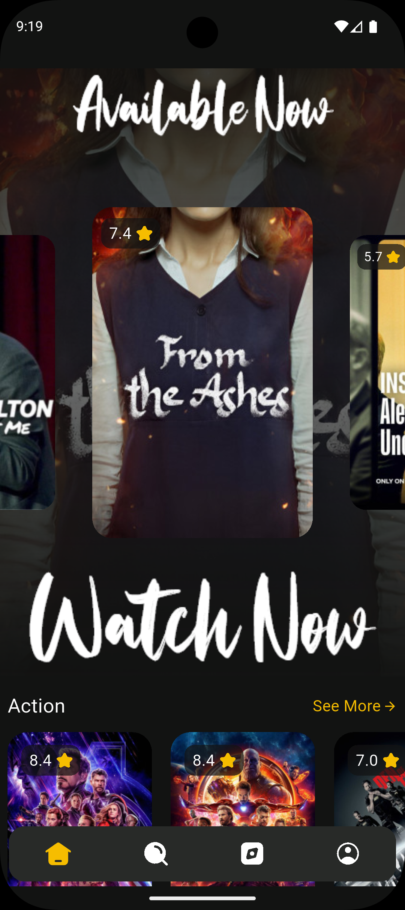
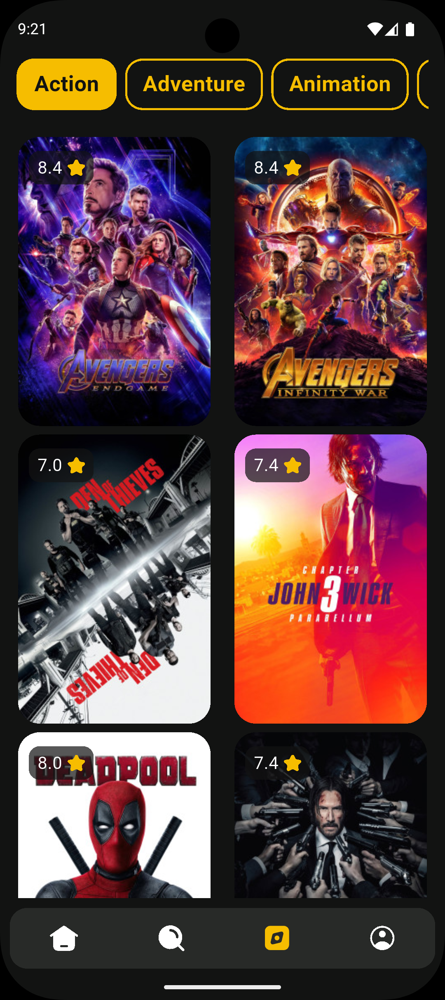

# 🎬 Movie App

A cross-platform mobile application built with **Flutter** that lets users discover, search, and explore movies — complete with authentication, personalized watchlists, viewing history, and multi-language support (English & Arabic).

The app fetches live movie data (details, cast, images, and suggestions) from a public movies API, while user accounts, wishlists, and history are managed through **Firebase Authentication** and **Cloud Firestore**.

---

## 📸 App Screens

<table>
<tr>
<td width="50%" valign="top">

<h3 align="center">Authentication — Login</h3>
<p>The entry point of the app. Users can sign in with their email and password or use <b>Google Sign-In</b> for one-tap authentication. It includes form validation, a loading state during the sign-in request, and links to password recovery and account creation.</p>
</td>
<td width="50%" valign="top">

<h3 align="center">Authentication — Sign Up</h3>
<p>Allows new users to create an account by providing their name, email, phone number, and password, along with an avatar picker to personalize their profile. Firebase Authentication creates the account, and the user's profile data is stored in Cloud Firestore right after registration.</p>
</td>
</tr>

<tr>
<td width="50%" valign="top">

<h3 align="center">Home</h3>
<p>The main landing screen after login. It features a trending movies carousel with a dynamic, enlarging card effect, along with horizontally scrollable rows of movies grouped by genre, each with a "see more" option to browse the full genre list.</p>
</td>
<td width="50%" valign="top">

<h3 align="center">Discover</h3>
<p>A dedicated genre browser. Users can pick a genre from a scrollable, tappable list and instantly load a grid of matching movies, complete with poster images and ratings for each title.</p>
</td>
</tr>

<tr>
<td width="50%" valign="top">

<h3 align="center">Search</h3>
<p>Lets users search the entire movie catalog by title. Results are displayed in real time as a grid of movie posters with ratings, and tapping any result opens its details page.</p>
</td>
<td width="50%" valign="top">

<h3 align="center">Movie Details — Overview</h3>
<p>A rich detail page for each movie, showing the poster, a play/watch action, and quick stats such as likes, runtime, and rating.</p>
</td>
</tr>

<tr>
<td width="50%" valign="top">

<h3 align="center">Movie Details — Screenshots & Similar</h3>
<p>Continues the details page with additional screenshots/stills from the movie, plus a "Similar" section suggesting related titles to keep browsing.</p>
</td>
<td width="50%" valign="top">

<h3 align="center">Movie Details — Summary & Cast</h3>
<p>Displays the movie's synopsis, genres, and full cast list with actor names and the characters they play. From here, users can add the movie to their wishlist, which also gets recorded into their viewing history.</p>
</td>
</tr>

<tr>
<td width="50%" valign="top">

<h3 align="center">Profile — Watchlist</h3>
<p>Displays all the movies the user has added to their wishlist, presented as a scrollable grid so they can quickly revisit titles they plan to watch.</p>
</td>
<td width="50%" valign="top">

<h3 align="center">Profile — History</h3>
<p>Keeps track of every movie the user has previously opened/viewed, giving them an easy way to look back at what they've already watched.</p>
</td>
</tr>

<tr>
<td width="50%" valign="top">

<h3 align="center">Profile — Edit Profile</h3>
<p>Lets users update their personal information — name, phone number, and avatar — and reflects those changes across the app in real time.</p>
</td>
<td width="50%" valign="top"></td>
</tr>
</table>

---

## 🛠️ Technical Overview

### Packages Used
| Package | Purpose |
|---|---|
| `flutter_bloc` | State management (Cubit-based) |
| `firebase_core` / `firebase_auth` | Firebase initialization & email/password + Google authentication |
| `cloud_firestore` | Storing and retrieving user data (profile, wishlist, history) |
| `google_sign_in` | Google OAuth sign-in flow |
| `http` | REST API networking layer |
| `cached_network_image` | Efficient loading & caching of remote movie posters/images |
| `carousel_slider` | Trending movies carousel on the Home screen |
| `scrollable_positioned_list` | Precisely scrollable genre selector on the Discover screen |
| `easy_localization` | English/Arabic localization and RTL support |
| `google_fonts` | Custom typography |
| `flutter_svg` | Rendering vector icon assets |
| `flutter_native_splash` | Native splash screen generation |

### State Management
The app uses **flutter_bloc (Cubit)** as its state management solution. Each feature has its own dedicated Cubit and corresponding state classes (sealed state hierarchies such as `Loading`, `Success`, `Error`), for example:
- `AuthViewModel` (Cubit) → `AuthState` for login, registration, Google sign-in, and password reset
- `UserViewModel` (Cubit) → `UserState` for profile data, wishlist, and history
- `GenreViewModel`, `TrendMoviesViewModel`, `MovieDetailsViewModel`, `SearchCubit`, `BrowseCubit` → each managing the state of its respective screen/widget

Widgets consume these Cubits via `BlocProvider`, `BlocBuilder`, and `BlocListener`, keeping UI rebuilds scoped to the exact piece of state that changed. A custom `MyBlocObserver` is also registered globally to observe state transitions across the app for easier debugging.

### Coding Architecture
The project follows a **feature-first, layered architecture** inspired by clean architecture principles:

```
lib/
├── api/                 # Low-level API client & endpoint/constants definitions
├── data/
│   └── repository/      # One folder per domain (movies, movie details, movie suggestions)
│       ├── data_sources/ # Remote data source interface + implementation
│       └── repository/   # Repository interface + implementation
├── models/              # Plain data models (JSON-serializable)
├── authentication/      # Login, Register, Reset Password screens + their Cubit
├── home/                # Home, Browse/Discover, Search, Movie Details, Profile — each with its own Cubit
├── on_boarding/         # Onboarding flow screens
├── core/utils/          # Theming, routing, styling, and shared utilities
├── widgets/             # Shared/reusable UI components
├── extensions/          # Dart/Flutter extension helpers (responsive sizing, validation)
├── lang/                # Generated localization keys/loader
└── di.dart              # Manual dependency injection (factory functions)
```

Each data-driven feature (Movies, Movie Details, Movie Suggestions) is split into three layers:
1. **Remote Data Source** — talks directly to the API via `ApiManger` and returns raw models.
2. **Repository** — an abstract contract with a concrete implementation that wraps the data source, providing a clean, swappable interface to the rest of the app.
3. **Cubit/ViewModel** — consumes the repository, exposes UI-ready state, and holds screen-specific logic (form keys, navigators, etc.).

Dependency wiring between these layers is done manually through factory functions in `di.dart` (e.g., `injectMoviesRepository()`), rather than a service locator or code-generated DI framework.

### Design Patterns
- **Repository Pattern** — abstracts data sources (remote API) behind repository interfaces, decoupling the UI/state layer from networking details.
- **Cubit/BLoC Pattern** — encapsulates business logic and state transitions outside of widgets, following a unidirectional data flow (UI → Cubit method → emitted state → UI rebuild).
- **Dependency Injection (manual/factory-based)** — `di.dart` centralizes the creation of repositories and data sources, making it easy to swap implementations (e.g., for testing) without touching UI code.
- **Navigator abstraction** — feature-specific "Navigator" classes (`LoginNavigator`, `RegisterNavigator`, `ResetNavigator`, `UserNavigator`) decouple Cubits from `BuildContext`/UI concerns like showing dialogs, loaders, and snackbars, keeping business logic UI-agnostic.
- **Feature-first modularization** — code is organized by feature (authentication, home, profile, etc.) rather than by type, improving cohesion and scalability.
- **Immutable state classes** — each Cubit has a sealed set of state classes representing every possible UI state (initial, loading, success, error), avoiding boolean-flag-driven UI logic.
